# Aula 45 - Banco de Dados e Introdução a SQL

## Exercício 1

### **a-)** 
id VARCHAR - O varchar é utilizado para declarar a variavel como string 
name VARCHAR - O varchar é utilizado para declarar a variavel como string 
birth_date DATE - O date é utilizado para declarar a variavel como data (ano, mes e dia)
gender VARCHAR - O varchar é utilizado para declarar a variavel como string 

### **b-)**
show databases - mostrará os seus bancos de dados centrais
show tables - mostrará suas tabelas existentes
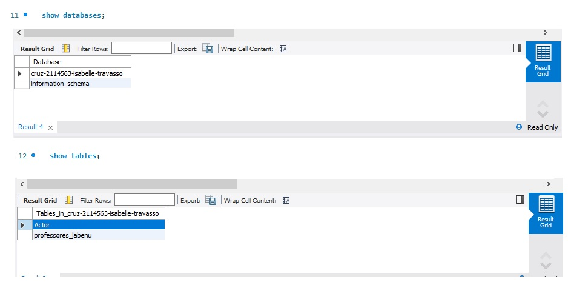

### **c-)** 
O comando describe Actor retorna a descrição de cada item da tabela Actor, sendo eles: campos, tipo, se pose ou não ser null, chave(exemplo id como chave primária), possiveis erros e extras
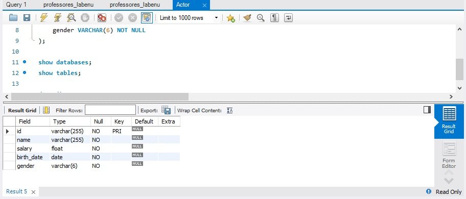

## Exercício 2

### **a-)**  
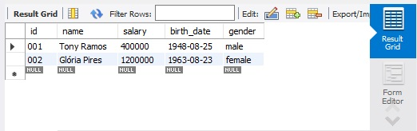


### **b-)** 
Ao adicionar um novo ator com uma chave primária já existente recebemos um erro explicando que essa chave está duplicada. Esse erro ocorre pois chaves primárias devem ser unicas, ou seja não podem conter 2 iguais.
<p style='color:red'>Error Code: 1062. Duplicate entry '002' for key 'PRIMARY'	0.156 sec</p>

### **c-)** 
O erro foi gerado pois foram passados mais informações do que as declaradas que iriam ser passadas
<p style='color:red'>Error Code: 1136. Column count doesn't match value count at row 1	0.156 sec </p>

### **d-)** 
O erro foi gerado pois nome é um campo que não pode ser null
<p style='color:red'>
Error Code: 1364. Field 'name' doesn't have a default value </p>

### **e-)** 
O erro foi gerado pois a data não está entre aspas
<p style='color:red'>Error Code: 1292. Incorrect date value: '1950' for column 'birth_date' at row 1
</p>

### **f-)** 


## Exercício 3

### **a-)**  
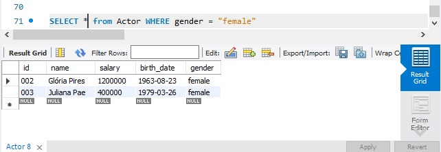

### **b-)**  
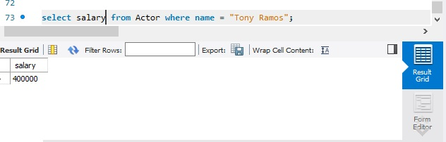

### **c-)**  
Para gender = invalid o retorno foi null, isto ocorre pois não temos nenhum dado na lista com genero inválido.
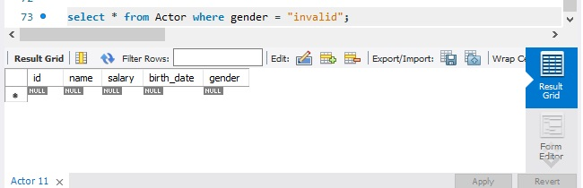

### **d-)** 
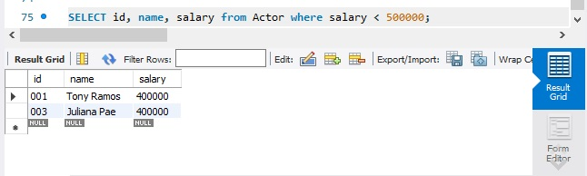

### **e-)**  
O erro ocorreu pois o campo nome não existe na tabela.
<p style='color:red'>Error Code: 1054. Unknown column 'nome' in 'field list'
</p>

O correta seria coloca o campo como name:
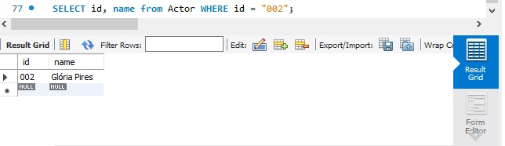

## Exercício 4


### **a-)**  
Para recebermos todas as informações do ator encontrado vamos utilizar o SELECT *, FROM Actor declara de qual tabela estamos procurando e WHERE serão as condições, sendo nomes chamacom o name, LIKE, para especificar um string e % depois da letra desejada para "fixa-la", ou seja <u>name like "A%"</u> Assim teremos todos os nome que comecem com a letra A. OR para adicionar outra condição de nome, agora com "J%", assim buscaremos nome que se iniciem com a letra J. AND para adicionar a condição de salário como salary, devendo ser maior que 300000.

### **b-)** 
A query seria:
SELECT * from Actor WHERE name like "A%" and salary > 350000;

Porém não tivemos retorno pois na lista nenhum Ator tem nome iniciado com A

### **c-)**
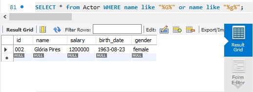

### **d-)**
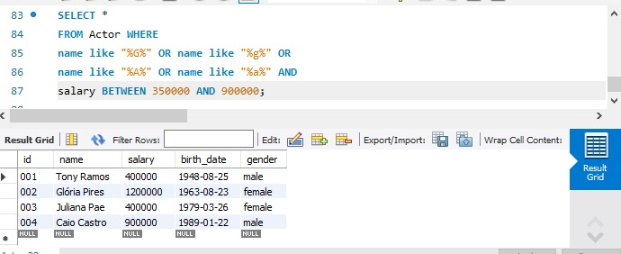

## Exercício 5
### **a-)** 
TEXT é um tipo que não possui um limite de tamanho, além de ser armazenado em uma área específica já que suportamente será grande.

```
CREATE TABLE Movies (
    id VARCHAR(255) PRIMARY KEY,
    title VARCHAR (255) NOT NULL,
    synopsis TEXT NOT NULL,
    date DATE NOT NULL,
    qualification INT NOT NULL
);

INSERT INTO Actor 
VALUES(
  "001", 
  "Se Eu Fosse Você",
  "Cláudio e Helena são casados há muitos anos e enfrentam a rotina do casamento. Um dia eles são atingidos por um fenômeno inexplicável e trocam de corpos",
  "2006-01-06", 
  7
), (
"002", 
  "Doce de mãe",
  "Dona Picucha, uma animada senhora de 85 anos, sempre causa grandes confusões. A vida dela e dos seus quatro filhos sofre uma reviravolta depois que Zaida, empregada e amiga de Dona Picucha, anuncia que vai se casar e não poderá mais morar com ela",
  "2012-12-27",
  10
), (
"003", 
  "Dona Flor e Seus Dois Maridos",
  "Dona Flor é uma sedutora professora de culinária casada com Vadinho, que só quer saber de farras e jogatina nas boates. A vida de abusos acaba por acarretar sua morte precoce.",
  "2017-11-02",
  8
  ), (
  "004", 
  "Minha mãe é uma peça",
  "Dona Hermínia (Paulo Gustavo) é uma mulher de meia idade, divorciada do marido (Herson Capri), que a trocou por uma mais jovem (Ingrid Guimarães). Hiperativa, ela não larga o pé de seus filhos Marcelina e Juliano (Mariana Xavier e Rodrigo Pandolfo), sem se dar conta que eles já estão bem grandinhos.",
  "2013-06-21",
  10
  );
```

## Exercício 6
### **a-)** 

``SELECT id, title, qualification FROM Movies WHERE id = 002``

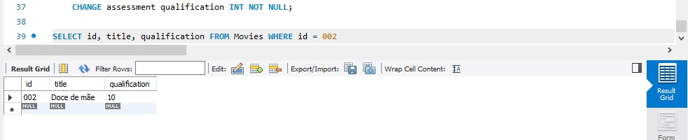

### **b-)** 
``SELECT * FROM Movies WHERE title = "Se eu fosse você"``

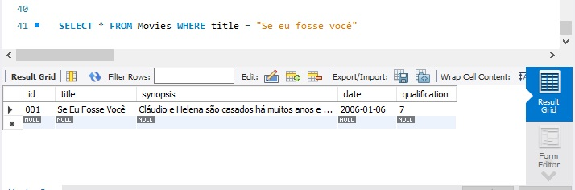

### **c-)**
``SELECT id, title, synopsis FROM Movies WHERE qualification > 7;`` 

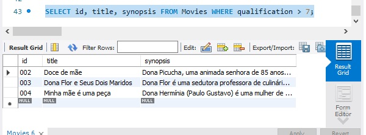 7" width="800"/>

## Exercício 7
### **a-)** 
``SELECT * FROM Movies WHERE title like "%vida%";``

Sem retorno pois não há esta palavra em nenhum dos títulos.

### **b-)** 
``SELECT * FROM Movies WHERE title like "%mãe%" or synopsis like "%flor%";`` 
Obs: pode ser utilizado o mesmo termo para os dois itens.

 7" width="800"/>

### **c-)** 
``SELECT * FROM Movies WHERE date <= curdate();``

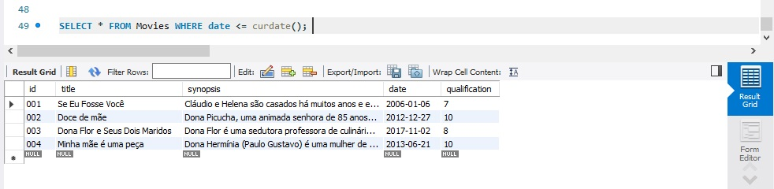 7" width="800"/>

### **d-)** 
``SELECT * FROM Movies WHERE date <= curdate() AND title like "%mãe%" or synopsis like "%mãe% AND qualification > 7";``

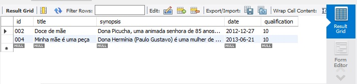