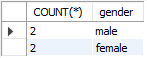

# Aula 46 - Aprofundamento SQL

## Exercício 1

### **a-)** 
``ALTER TABLE Actor DROP COLUMN salary;``
Apagariamos a coluna salário da tabela Atores

### **b-)** 
``ALTER TABLE Actor CHANGE gender sex VARCHAR(6);``
Alterariamos o nome da coluna de gender para sex.

### **c-)**
``ALTER TABLE Actor CHANGE gender gender VARCHAR(255);`` 
Alterariamos a quantidade de caracteres aceitos na coluna gender

### **d-)**
``ALTER TABLE Actor CHANGE gender gender VARCHAR(100);``

## Exercício 2

### **a-)** 
``UPDATE Actor SET name = 'Juliana Paes', birth_date = '1979-03-26' WHERE id = "003"``

### **b-)** 
``UPDATE Actor SET name = 'JULIANA PAES' WHERE id = "003"``
``

### **c-)**
``UPDATE Actor SET name = 'Fabio Pillar', salary = 600000, birth_date = '1960-08-29', gender = "male" WHERE id = "005"``

### **d-)**
Se o utilizado o update para um Id que não existente o programa percorrerá todos os dados retornará como processo feito e não haverá alterações na tabela. 
Caso a atualizazão seja feita com o fied inexistente teremos o seguinte retorno:

Error Code: 1054. Unknown column 'test' in 'field list'

## Exercício 3

### **a-)** 
``DELETE FROM Actor WHERE name = "Fernanda Montenegro"``

### **b-)**
``DELETE FROM Actor WHERE gender = 'male' AND salary > 1000000`` 

## Exercício 4

### **a-)** 
``SELECT MAX(salary) FROM Actor``

### **b-)**
``SELECT MIN(salary) FROM Actor WHERE gender = 'female'``

### **c-)**
``SELECT count(*) FROM Actor WHERE gender = 'female'``

### **d-)**
``SELECT SUM(salary) FROM Actor``

## Exercício 5

### **a-)** 
Temos como retorno a contagem de atores e atrizes de acordo com o gêneno

### **b-)** 
``SELECT id, name FROM Actor ORDER BY name DESC``

### **c-)**
``SELECT * FROM Actor ORDER BY salary ASC``

### **d-)**
``SELECT * FROM Actor
ORDER BY salary DESC
LIMIT 3``

### **e-)**
``SELECT AVG(salary), gender FROM Actor
GROUP BY gender``

## Exercício 6

### **a-)** 
``ALTER TABLE Movies ADD playing_limit_date DATE``

### **b-)**
``ALTER TABLE Movies CHANGE qualification rating FLOAT NOT NULL`` 

### **c-)**
``UPDATE Movies SET playing_limit_date = '2021-05-29' WHERE id = "004"``

``UPDATE Movies SET playing_limit_date = '2019-03-08' WHERE id = "001"``

### **d-)**
``DELETE FROM Movies WHERE id = "005"``

Quando utilizado o update para um Id que não existente o programa percorrerá todos os dados retornará como processo feito, sem erros, porém não haverá alterações na tabela. 
``UPDATE Movies SET synopsis = 'Teste de ID inexistente' WHERE id = "005"``

## Exercício 7

### **a-)** 
``SELECT count(*) FROM Movies WHERE rating > 7.5``

Resposta 3 filmes possuem qualificação maior que 7,5

### **b-)** 
``SELECT AVG(rating) FROM Movies``

Resposta 8,75 é a média das avaliações dos filmes

### **c-)** 
``SELECT count(*) FROM Movies WHERE playing_limit_date >= curdate()``

Resposta a quantidade de filmes em cartaz é 1

### **d-)** 
``SELECT count(*) FROM Movies WHERE date > curdate()``

### **e-)** 
``SELECT MAX(rating) FROM Movies``

### **f-)** 
``SELECT MIN(rating) FROM Movies``

## Exercício 7

### **a-)** 
``SELECT * FROM Movies ORDER BY title ASC``

### **b-)**
``SELECT * FROM Movies ORDER BY title ASC LIMIT 5``

### **c-)**
``SELECT * FROM Movies ORDER BY date DESC LIMIT 3``

### **d-)**
``SELECT * FROM Movies ORDER BY rating DESC LIMIT 3``